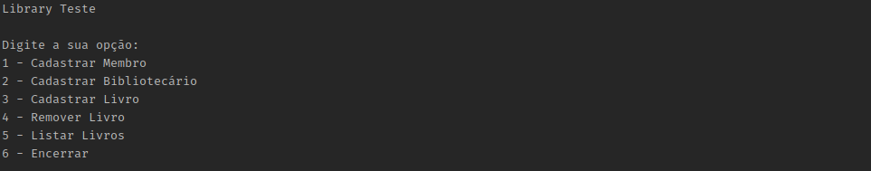

# 📚 Library System

A simple console-based Library Management System in C# demonstrating object-oriented programming (OOP) principles like encapsulation, composition, and role-based actions.

## 🚀 Features

- Add and remove books to/from the library (by Librarian)
- Borrow books (by Member)
- List all books with status (borrowed or available)
- Find books by title

## 🏗️ Technologies

- C#
- .NET Console App

## ▶️ How to Run

1. Clone the repository or copy the files into a new console project:
   ```bash
   git clone https://github.com/KalielSoares/LibSystem.git
   cd LibSystem

2. Build and run the project
    ```bash
   dotnet run
   
## 🧑‍💻 Author

Kaliel Soares

